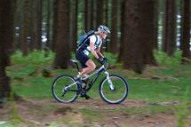

{: .float-right .img-right}

#### Huur

* In Altenhundem, (10 km van Oberhundem) zijn fietsen te huur. In het huisje ligt een folder. De verhuurder zit in de parkeergarage in het centrum, tegenover het station (aan de voet van de kerk). 
* Ook in Oberhundem zelf zijn fietsen te huur.
* <a href="https://www.lennestadt-kirchhundem.de/Radfahren/Verleihstationen-und-Reparaturservice2" target="_blank">Klik hier ovor meer info</a>

#### Fietsroutes

Er zijn in de omgeving aardig wat gemarkeerde fietsroutes. Sommige daarvan kennen niet heel veel hoogteverschil, andere zijn een stuk pittiger (Sauerland is tenslotte behoorlijk heuvelachtig). De routes lopen soms gewoon over de verkeerswegen, maar er zijn veel vrijliggende fietspaden (naar onze indruk komen er snel meer bij).  
In het huisje liggen diverse fietsroutekaarten, en de routes zijn langs de weg over het algemeen heel goed aangegeven met bordjes. In het huisje zijn enkele beschrijvingen van door ons gefietste routes.  
<a href="http://www.sauerland.com/Sauerland-entdecken/Radfahren2" target="_blank">Klik hier voor meer info</a>

Voor de mountainbikers zijn er vooral routes uitgezet en gemarkeerd in Hochsauerland, rond Winterberg. Er zijn echter ook rond Oberhundem talloze mogelijkheden over boswegen en  paden. Liefhebbers zouden de gemarkeerde wandelroutes kunnen volgen.
Veel van de fiets- en mountainbikeroutes zijn gemarkeerd door "Bike Arena Sauerland". Behalve gedrukte kaarten (waarvan enkele in het huisje) hebben zij een uitgebreide website, <a href="http://www.bike-arena.de" target="_blank">http://www.bike-arena.de</a>. Van die site zijn ook veel GPS-tracks van fietsroutes te downloaden.

