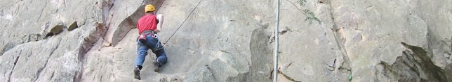

Bij Nederlandse klimmers zijn de klimgebieden van het Sauerland nog niet erg bekend. Toch zijn hier tal van kleine klimgebieden. Eind mei 2013 is één van de grootste klimgebieden van het Sauerland feestelijk geopend;  de <a href="http://kletterarena.info/hillenberg.php">Hilleberg bij Warstein.</a>

Voor meer info zie: <a href="http://kletterarena.info/">http://kletterarena.info</a> en <a href="http://felsinfo.alpenverein.de/">http://felsinfo.alpenverein.de/</a>. Ook op de site van de NKBV is informatie te vinden over deze gebieden. Zie: <a href="http://www.nkbv.nl/sportklimmen/klimgebieden/klimmen-in-duitsland">http://www.nkbv.nl/sportklimmen/klimgebieden/klimmen-in-duitsland</a>.

In de NKBV-webshop kun je de <a href="http://www.nkbv.nl/webshop/Land+der+tausend+Berge+-+Sauerland+/112">klimtopo van het Sauerland</a> kopen. 

Let op: Sommige gebieden kunnen gesloten zijn vanwege steenslaggevaar of natuurbescherming. Kijk daarom ook altijd op <a href="http://kletterarena.info/klettergebiete.php">http://kletterarena.info/klettergebiete.php</a>.

<h2>Lokaties van de klimrotsen</h2>

Hieronder op de kaart de kliklocaties. Door te klikken op de "markers" is meer informatie te krijgen.

&nbsp;

