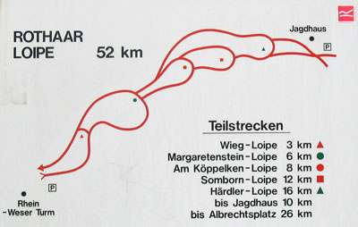
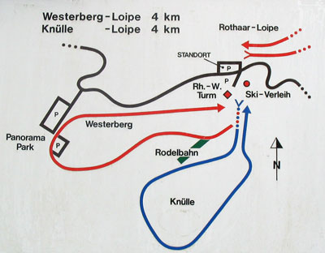

In de omgeving van het huisje zijn prachtige langlauftochten te maken. Bij veel sneeuw direct vanuit het huis, bij wat minder sneeuw b.v. vanaf de op 5 km afstand gelegen Rein-Wesser-Turm:

Enkele links:

* Langlauf bij [Rhein-Wesser-Turm](http://www.nordicsport-arena.de/de/nsa/skigebiete/detail/rhein-weser-turm-9842)
* Loipe [Klein Rothhaarloipe](http://www.loipenportal.de/sauerland?sid=10580 )
* Loipe [Knulle Loipe](http://www.loipenportal.de/sauerland?sid=10577 )
* Loipe [Margarethenstein-Loipe](http://www.loipenportal.de/sauerland?sid=10330 )

&nbsp; 

{: .float-right .img-right}

&nbsp;

* "Rothaar-Loipe": Länge 52 km,  
Höhendifferenz 160 m ; Rhein-Weser-Turm  -  Jagdhaus – Kühhude – Albrechtsplatz und parallel zurück zum Rhein-Weser-Turm; innerhalb der Rothaar-Loipe gibt es 5 verschiedene Schleifen von 3 / 6 / 8 / 12 und 16 km Länge mit Höhendifferenzen von 20 / 40 / 50 und 70 Metern.

&nbsp;

&nbsp;

* "Knülle-Loipe": Länge 4 km;
Höhendifferenz 10 m
* "Westerberg-Loipe": Länge 4 km,  
Höhendifferenz 40 m

