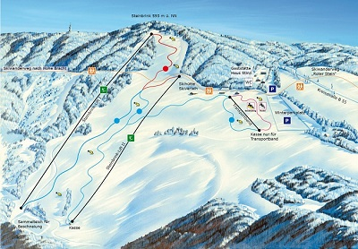
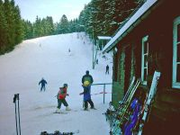

[Klik hier](#/content/Informatie/Sneeuwverwachting) voor links naar actuele sneeuwberichten.

Winterberg en Willingen zijn de bekendste wintersportplaatsen in het Sauerland. Winterberg ligt op ca 45 km afstand. Willingen op is ruim 65. 

Dichterbij ligt Schmallenberg. Informatie op [www.schmallenberg.de](http://www.schmallenberg.de) 
en [www.schmallenberger-sauerland.de](http://www.schmallenberger-sauerland.de)

---
{: .float-right .img-right}

&nbsp;

***Fahlenscheid***

Op circa 20 km afstand ligt Fahlenscheid ([www.fahlenscheid.de](http://www.fahlenscheid.de)). 
Dit gebied ligt tussen het huisje en de autoweg A45 (ri. Dortmund).

&nbsp;

&nbsp;

&nbsp;

&nbsp;

&nbsp;

&nbsp;

---

{: .float-right .img-right}

***Skipiste Oberhundem***

Op enkele kilometers vanaf het huis is ook een kleine piste. Voor een middagje skiën of een poosje oefenen prima geschikt. Vanaf het huisje richting Panorama-park, de parkeerplaats is rechts, de piste links.

Openingstijden:

Ma t/m Vr   14:30  -  17:00  
Za en Zo     10:00  -  17:00

Prijzen

Ma t/m Vr   € 5,00  
Za en Zo     € 7,50  
Kinderen     € 3,30

Skihut aanwezig, geen materiaal huur

[http://www.oberhundem.com/index.php/Wintersport.html](http://www.oberhundem.com/index.php/Wintersport.html)

