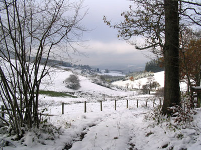

{: .float-right .max-50}

In de omgeving van het huisje zijn prachtige wandelingen te maken. Routebeschrijvingen van een aantal wandelingen zijn in het huis aanwezig.
Deze beschrijvingen worden ook via mail naar huurders gestuurd.

Tevens is een topografische kaart van het gebied aanwezig.

We hebben ook een aantal GPX routes beschikbaar. Deze zijn te downloaden via deze link: [GPX Routes download](https://drive.google.com/drive/folders/1wsDwTVlzCUB7dHdc8c4UmmX23gleA8Nr)

---

De volgende routebeschrijvingen zijn aanwezig: 

---

***Door het beekdal van de Wiggesiepen***

kort 4 kilometer, 100 meter stijgen en dalen  
lang 8 kilometer, 200 meter stijgen en dalen

Korte wandelingen ten oosten van het Feriendorf.

---

***Rond de Rinsenberg***

5½ kilometer, 350 meter stijgen en dalen

Rond de berg aan de westkant van het Feriendorf. Relatief veel hoogtemeters, in drie stijgingen en dalingen. Halverwege horeca in Rinsecke (Gasthof Kaiser, dinsdags gesloten).

---

***Naar de Albaumer Klippen***

12 kilometer, 450 meter stijgen en dalen  
extra rondje 2 kilometer, 100 meter stijgen en dalen

Albaumer Klippen is een beschermd natuurgebied met een reeks rotstoppen in het bos. Vanaf de hoogste mooi uitzicht.

---

***De Rhein-Weser-Turm en de Oberhundemer Klippen***

kort 7½ kilometer, 300 meter stijgen en dalen  
lang 15 kilometer, 500 meter stijgen en dalen

Weer grotendeels een - afwisselende - boswandeling, maar de lange wandeling komt ook door het schilderachtig gelegen dorp Rüspe. De Rhein-Weser-Turm is een uitzichttoren. De Oberhundemer Klippen zijn niet spectaculair maar wel een mooie pauzeplek kort voor het einde van de wandeling. Horeca in en bij de Rhein-Weser-Turm.

---

***Het dal van de Hundem***

kort 14 kilometer, 400 meter stijgen en dalen  
lang 20 kilometer, 600 meter stijgen en dalen

Deze wandeling loopt aan de noordkant van Oberhundem naar Würdinghausen, en langs de zuidkant weer terug. Hij kruist daarbij een aantal zijdalen van de Hundem, met elke keer een dorpje. Door de vele mogelijkheden om te schuilen (horeca in Selbecke, Würdinghausen, Böminghausen, Rinsecke) is dit een heel geschikte wandeling bij onbestendig weer; maar ook op mooie dagen is het een prachtige en afwisselende wandeling.

---

***De bergrug tussen Hundem en Lenne***

kort 14 kilometer, 200 meter stijgen en dalen  
middellang 18 kilometer, 300 meter stijgen en dalen  
lang 22 kilometer, 400 meter stijgen en dalen

Klassieke wandeling, nu ook deel van de "Wanderweg der Deutschen Einheit" (van oost- naar westgrens van Duitsland). Heen vooral naaldbos, terug ook veel loofbos. Veel uitzichten en veel bronnetjes langs de boswegen. Op de heenweg via Oberhundem en na 7 kilometer langs het Alpenhaus (berghut/horeca, dinsdags gesloten).

