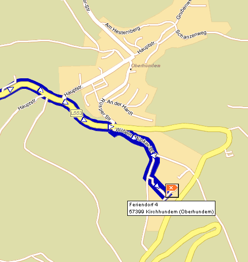

Feriendorf 4 
57399 Oberhundem

#### Routebeschrijving vanaf Arnhem naar Oberhundem

Eerst over de snelweg naar Olpe:

* vanaf Arnhem richting Oberhausen, A12 (Nederland) en A3 (Duitsland)
* na ca. 80 km ter hoogte van Oberhausen (afslag 10) de A2 richting Hannover nemen
* na ca. 35 km voor Dortmund (afslag 12) de A45 richting Frankfurt nemen
* na ca. 85 km afslag 18 Olpe nemen.

Van Olpe naar het huisje is nog zo'n 35 kilometer (over kleine wegen).
Eerst Olpe stad aanhouden en vervolgens B54/55 richting "Panoramapark" (N.B. het huisje ligt vlakbij dit Panoramapark!). De B55 ongeveer 10 kilometer volgen, dan bij een rotonde rechtsaf richting Kirchhundem / Panoramapark. Richting Kirchhundem / Panoramapark ca. 20 km blijven volgend. Dan in Kirchhundem naar Oberhundem.

Bij Oberhundem niet links het dorp in maar rechtdoor richting Panoramapark. Let op: na 300 meter rechts naar beneden, wegwijzer o.a. Feriendorf. Dan op een driesprong bij een voetbalveld rechts aanhouden (wegwijzer Feriendorf).

Het park is na 150 meter aan de linkerkant (direct na een blok garages). Er gaat een weggetje omhoog het park in (wegwijzer Feriendorf), dan het eerste huisje aan de rechterkant.

Totale afstand vanaf Arnhem: 245 kilometer.

Voor de GPS: UTM-coördinaten 32U 0442344/5658916

Voor de routeplanner: de postcode is 57399

  

