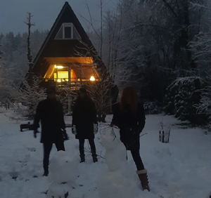

{: .float-right .img-right}
     

Sinds 2004 hebben wij dit huisje in Sauerland. In de zomer een fijne plek om te luieren, te wandelen, te zwemmen en vuurtje te stoken.
In de winter, als er sneeuw ligt, kun je er prima langlaufen. Maar ook zonder sneeuw is het heerlijk om buiten te zijn om te wandelen.
Het huisje ligt buiten Oberhundem op een stuk grond met meerdere huisjes. Sommige huisjes worden permanent gebruikt en sommige alleen als vakantiehuisje.
Er is een grote tuin en dus zie of hoor je de buren niet. Het is er heerlijk rustig met veel groen een prettige atmosfeer.
Het huisje zelf is plezierig eenvoudig en goed ingericht.

{: .d-none .d-md-block}

We verhuren het huisje graag aan vrienden en bekenden. Zie de [Verhuur pagina](#/content/Verhuur/Beschikbaarheid) voor informatie over huren.

Lies Pol  
Guus Pol  
Wim van der Laan  
Hanno van Maanen

