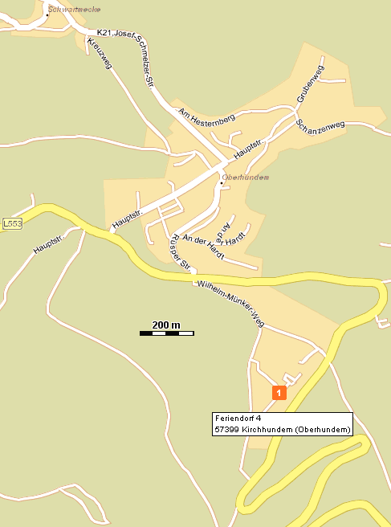

{: .float-right .img-right}

[www.oberhundem.com](http://www.oberhundem.com)  
[www.oberhundem-das-dorf.de](http://www.oberhundem-das-dorf.de)  
[www.kirchhundem.de](http://www.kirchhundem.de)  
[www.lennestadt-kirchhundem.info](http://www.lennestadt-kirchhundem.info)

