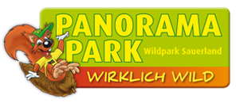
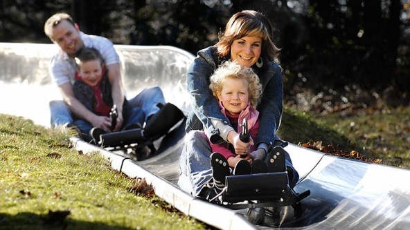

{: .float-right .img-right}

Prachtig gelegen in de bossen van het Rothaar gebergte en op enkele kilometers afstand van het huisje ligt het Panorama-Park Sauerland. Op een gebied  van 80 ha wordt vertier geboden voor jong en oud.
Een pretpark met de mooiste rollerbobbaan van Duitsland, glijbanen, labyrinth en veel andere attracties. Daarnaast is het ook een safaripark met bisons en wilde zwijnen.

Het park is van mei t/m oktober vrijwel doorlopend geopend.

Kijk voor informatie op de website [www.panopark.de](http://www.panopark.de)

